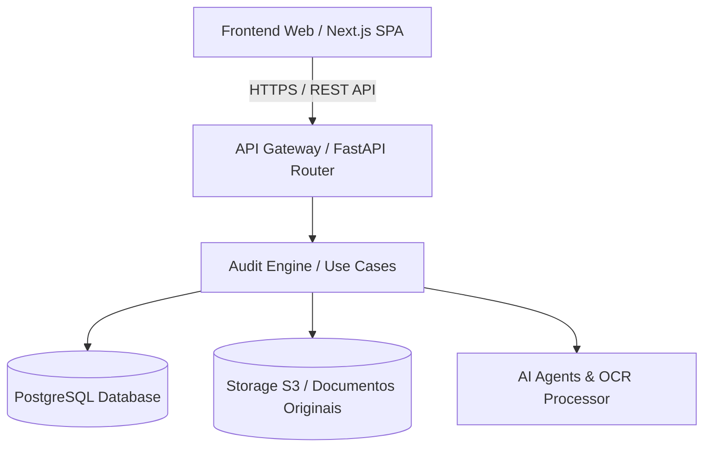

# Arquitetura do Sistema — DHV Audit AI

## Visão Geral
O sistema `dhv-audit-ai` é construído seguindo os princípios de **Clean Architecture**, **Domain-Driven Design (DDD)** e padrões definidos na Constituição de Engenharia Inexer.

## Diagrama C4: Nível 1 — Contexto do Sistema
```mermaid
graph TD
    UserClient[Cliente / Gestor] -->|Envia documentos & Acompanha achados| System[DHV Audit AI Platform]
    UserConsultant[Consultor DHV] -->|Valida achados & Gerencia auditorias| System
    System -->|Consulta dados fiscais| SEFAZ[Portal SEFAZ / Receita Federal]
    System -->|Integração ERP| ERP[ERPs (SAP, TOTVS, Sankhya)]
    System -->|Processamento de IA| LLM[Provedor de LLM / OCR (AWS/OpenAI/Anthropic)]
```

## Diagrama C4: Nível 2 — Contêineres


## Camadas da Clean Architecture
1. **Domain (`src/domain/`)**: Entidades de negócio puras, Value Objects e interfaces de repositório. Zero dependências externas.
2. **Application (`src/application/`)**: Casos de uso da auditoria, orquestração de fluxos, DTOs de entrada e saída.
3. **Interfaces (`src/interfaces/`)**: Roteadores FastAPI, controladores e adaptadores HTTP.
4. **Infrastructure (`src/infrastructure/`)**: Implementações concretas de persistência (SQLAlchemy), clientes de IA/OCR e storage de arquivos.
