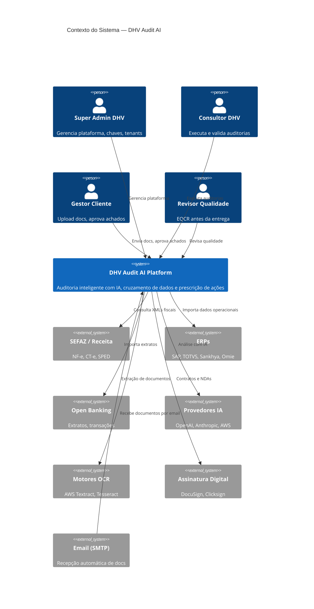
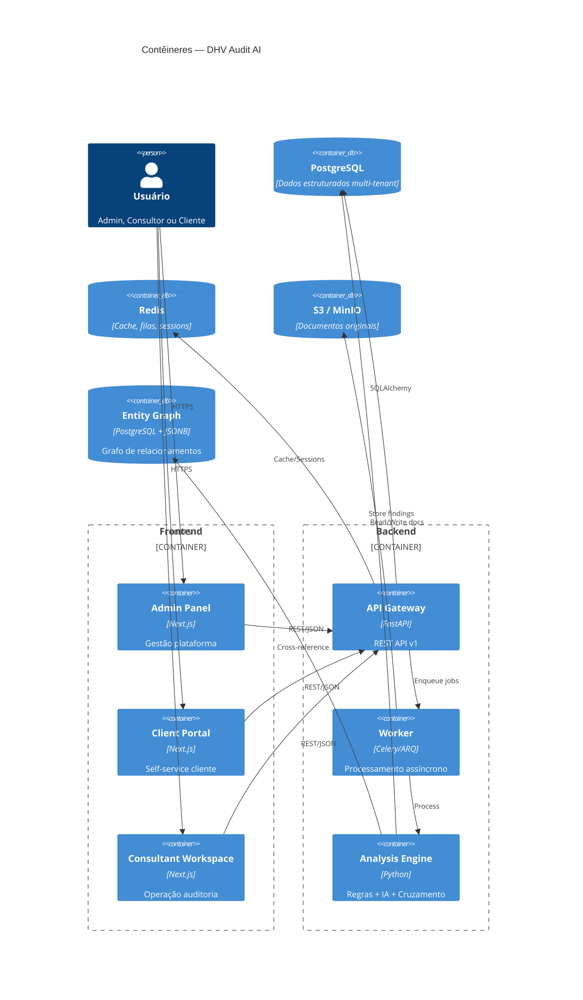
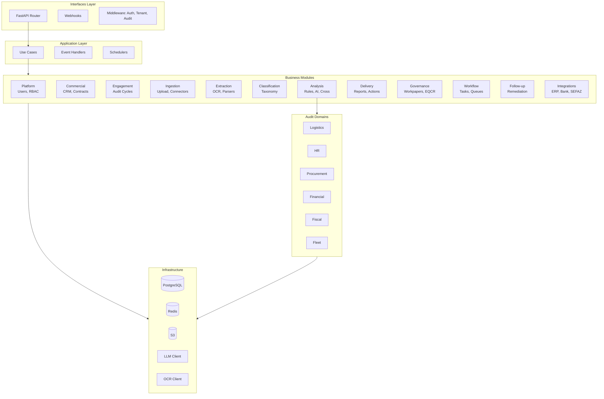
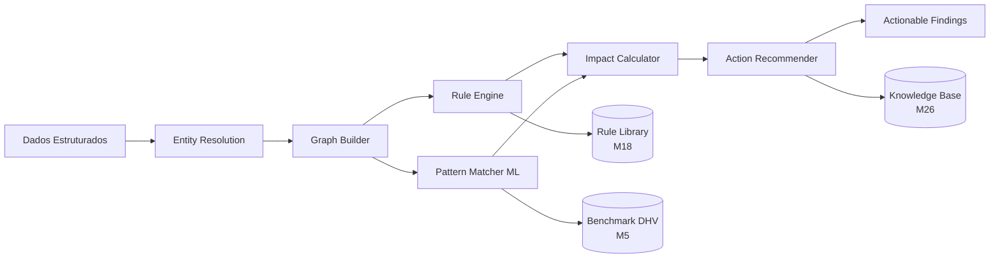

# Diagramas C4 — DHV Audit AI Platform

## Nível 1 — Contexto do Sistema

---

## Nível 2 — Contêineres

---

## Nível 3 — Componentes do Backend (Módulos)

---

## Nível 4 — Componentes do Analysis Engine

