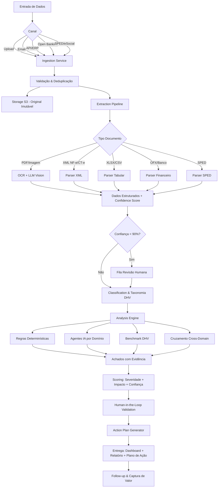
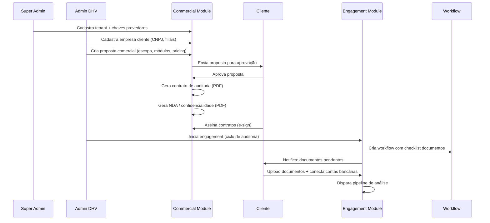
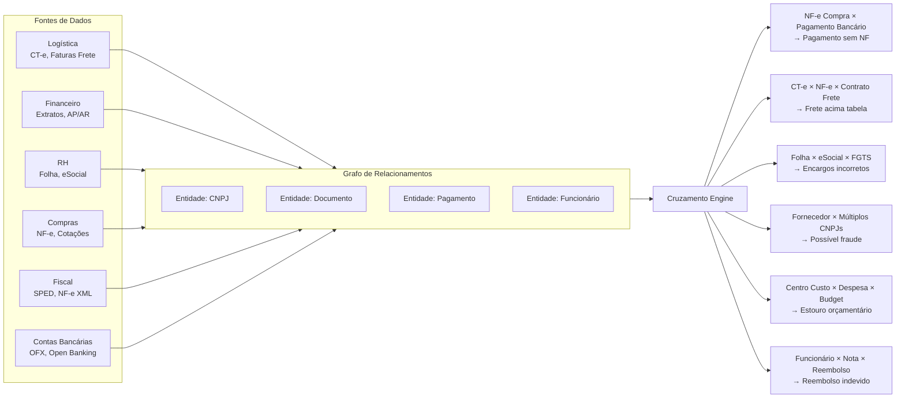
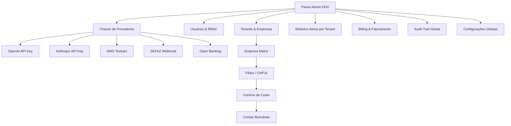

# Fluxo de Dados — Pipeline Ponta a Ponta

## 1. Fluxo Principal: Documento → Ação

---

## 2. Fluxo Comercial: Cliente → Contrato → Auditoria

---

## 3. Fluxo de Cruzamento de Dados (Cross-Domain)

---

## 4. Fluxo Admin: Gestão da Plataforma

---

## 5. Eventos de Domínio (Event-Driven)

| Evento | Produtor | Consumidores |
|---|---|---|
| `DocumentUploaded` | Ingestion | Extraction, Workflow |
| `DocumentExtracted` | Extraction | Classification, Review Queue |
| `DocumentClassified` | Classification | Analysis |
| `FindingDetected` | Analysis | Review Queue, Dashboard, Chat |
| `FindingValidated` | Governance | Action Plan, Follow-up |
| `ActionPlanGenerated` | Delivery | Client Portal, Workflow |
| `EngagementStarted` | Engagement | Ingestion, Workflow, Contracts |
| `ContractSigned` | Commercial | Engagement, Governance |
| `CrossReferenceDetected` | Analysis | Consultant Workspace |
| `ValueCaptured` | Follow-up | Dashboard, Billing |

---

## 6. Filas Assíncronas

| Fila | Prioridade | SLA |
|---|---|---|
| `extraction.ocr` | Normal | < 5 min/documento |
| `extraction.xml` | Alta | < 30 seg/documento |
| `analysis.rules` | Alta | < 2 min/lote |
| `analysis.ai` | Normal | < 10 min/lote |
| `analysis.cross_domain` | Normal | < 15 min/engagement |
| `reports.generate` | Baixa | < 30 min/relatório |
| `contracts.generate` | Alta | < 1 min/documento |
| `notifications.email` | Normal | < 1 min |
| `review.human` | Crítica | SLA definido por engagement |
