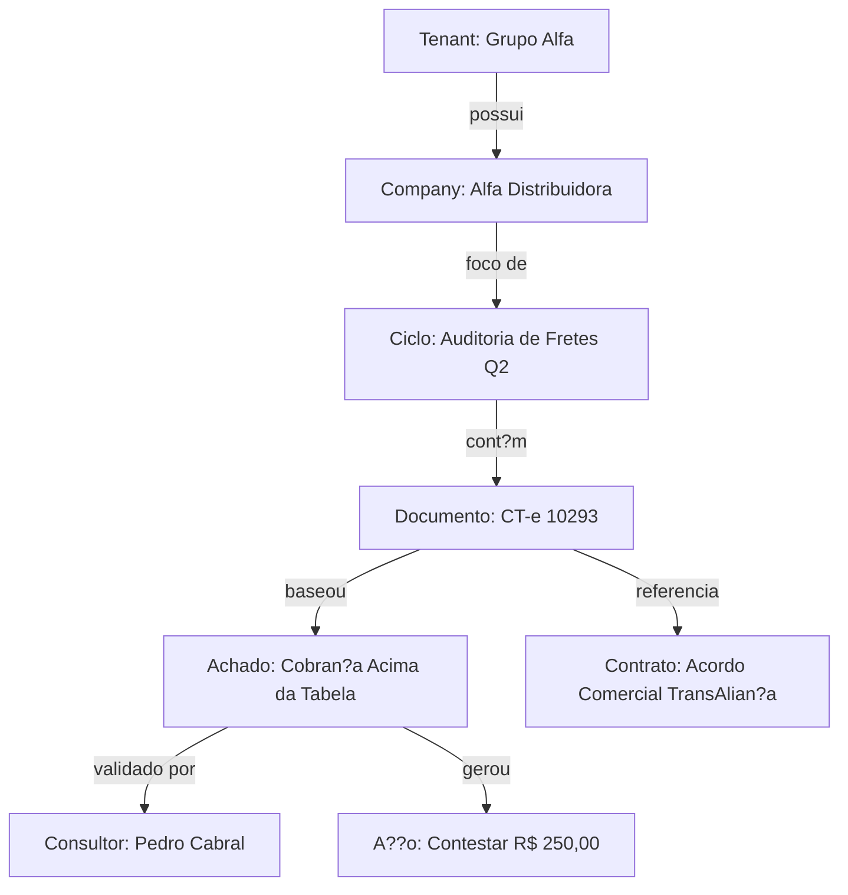

# Arquitetura do Banco RAG e Base de Conhecimento Inteligente

Para transformar o **M9 (Assistente de IA / Chat com RAG)** em um motor de busca altamente inteligente, capaz de contextualizar auditorias, clientes, achados e contratos de forma precisa, a plataforma n?o deve se limitar a um RAG tradicional (vetoriza??o simples de textos planos). 

Abaixo, detalha-se a estrat?gia avan?ada de ingest?o, enriquecimento de metadados, busca h?brida e conex?es de grafo para otimizar a rastreabilidade e a precis?o do assistente de IA.

---

## 1. Estrutura de Metadados Ricos (Filtros e Self-Querying)

Toda informa??o inserida no banco vetorial (seja um trecho de contrato, uma linha de transa??o de frete, ou um achado de auditoria) deve ser enriquecida com uma taxonomia de metadados r?gida. Isso permite ao RAG realizar **Self-Querying** (converter a pergunta em linguagem natural do usu?rio em filtros estruturados de banco de dados *antes* da busca por similaridade vetorial).

### Matriz de Metadados Recomendada para Chunks

```json
{
  "chunk_id": "vptr-7788-99ab",
  "document_id": "doc-uuid-1122",
  "tenant_id": "tenant-uuid-3344",
  "company_id": "company-uuid-5566",
  "audit_cycle_id": "cycle-uuid-7788",
  "domain": "logistics", -- logistics, hr, procurement, financial, fiscal, fleet
  "entity_type": "finding", -- contract, document_extracted, audit_summary, finding, human_comment, regulation
  "created_at": "2026-08-17T16:00:00Z",
  "reference_keys": {
    "cnpj_target": "12345678000199",
    "provider_name": "TransAlian?a S/A",
    "value_impact": 12450.00,
    "severity": "high",
    "status": "validated" -- validated, pending, rejected
  }
}
```

---

## 2. Abordagem Graph-RAG (Vincula??o de Entidades)

Em vez de tratar chunks de forma isolada, o RAG da plataforma deve adotar uma abordagem baseada em **Knowledge Graphs** (Grafos de Conhecimento), conectando semanticamente as entidades do sistema.



### Como isso melhora a busca?
Ao realizar a ingest?o de um achado (*Finding*), o chunk vetorial correspondente deve conter a inje??o pr?-compilada das suas rela??es f?sicas:  
*Exemplo de chunk injetado:* `"O Achado F-555 (Cobran?a Acima da Tabela) com impacto de R$ 250,00 foi identificado no CT-e 10293 para o cliente Alfa Distribuidora no ciclo Q2/2026. Este achado infringe a Cl?usula 4.2 do Contrato de Transporte firmado com a TransAlian?a S/A."*

---

## 3. Fontes de Dados Cr?ticas para Enriquecer o RAG

Para maximizar o poder de resposta da IA do consultor e do cliente, as seguintes fontes de dados devem ser integradas ao banco vetorial:

### A. Hist?rico de Decis?es Humanas (Human-in-the-Loop Feedback)
- **O que adicionar:** Coment?rios, notas internas, justificativas de descarte de achados e notas de auditoria geradas pelos consultores durante as valida??es.
- **Por que:** Permite que a IA responda a perguntas como *"Por que desconsideramos o desvio de peso cubado no lote do m?s passado?"* com base na justificativa real inserida pelo consultor s?nior.

### B. Regulamenta??es, Resolu??es e Legisla??es Setoriais
- **O que adicionar:** Tabelas de tarifas m?nimas da ANTT, regras de tributa??o de ICMS por UF, regulamentos do eSocial, conven??es coletivas de sindicatos ativos (CCTs).
- **Por que:** D? suporte ? IA para responder d?vidas regulat?rias complexas, como *"Qual ? o embasamento legal para contestar essa reten??o de ISS na NFS-e de limpeza?"*.

### C. Playbooks e Metodologias Internas da DHV Log
- **O que adicionar:** Manuais de melhores pr?ticas de auditoria, playbooks de onboarding de consultores, estrat?gias hist?ricas de negocia??o e termos de contesta??o padr?o.
- **Por que:** Age como o c?rebro da consultoria, treinando novos profissionais e sugerindo abordagens comerciais de sucesso para capturar economias (*savings*).

---

## 4. Estrat?gia de Busca H?brida (Dense + Sparse Retrieval)

Para buscas eficientes sobre auditorias e clientes, a arquitetura deve utilizar busca h?brida:

1. **Busca Vetorial Densa (Dense Embedding - ex: `text-embedding-3-large`):** Capta a inten??o sem?ntica da pergunta. ?tima para perguntas conceituais (*"vazamento de receita por frete fracionado"*).
2. **Busca Esparsa de Palavras-chave (Sparse Search - ex: `BM25` ou `Elasticsearch`):** Crucial para encontrar correspond?ncias exatas de identificadores que modelos vetoriais costumam falhar, tais como:
   - Chaves de acesso de NF-e/CT-e (44 d?gitos).
   - N?meros de CNPJs ou CPFs.
   - Nomes de produtos qu?micos ou NCMs espec?ficos.
   - C?digos de transa??es banc?rias.

---

## 5. Arquitetura Text-to-SQL de Fallback (Busca Quantitativa)

Consultas a respeito de m?tricas consolidadas e buscas de clientes frequentemente envolvem matem?tica de agrega??o, onde o RAG convencional falha (ex: *"Qual o total de economia capturada para o cliente Alfa em 2026?"*).

### Solu??o: Agente H?brido RAG + SQL
- O assistente de IA analisa a pergunta do usu?rio.
- Se a pergunta exigir agrega??o quantitativa (*"quanto"*, *"quantas faturas"*, *"totalizado por"*), o agente utiliza uma ferramenta de **Text-to-SQL** (previamente configurada com o schema do PostgreSQL detalhado no `schema-overview.md`).
- A IA gera a consulta SQL segura, executa-a com par?metros protegidos contra SQL Injection, obt?m o resultado exato (ex: `R$ 840.200,00`) e usa o RAG apenas para trazer o contexto explicativo dos achados correspondentes de forma unificada.
