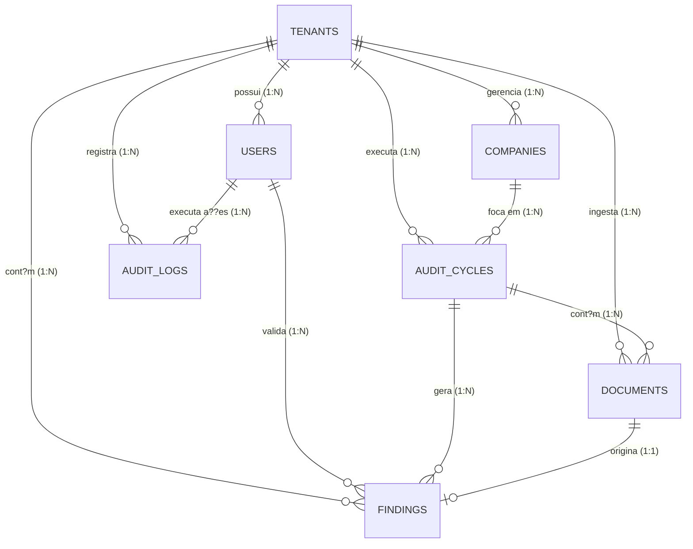

# Relacionamentos de Entidades (Entity Relationship Diagram - ERD)

Este documento detalha o modelo relacional de dados da plataforma **DHV Audit AI**, destacando as chaves estrangeiras, cardinalidades e a aplica??o de integridade referencial.

---

## 1. Diagrama de Relacionamento (Mermaid)

---

## 2. Descri??o das Cardinalidades e Regras de Integridade

### A. Tenant (Grupo Econ?mico/Multi-tenant)
- Um **Tenant** ? o n? raiz absoluto do isolamento l?gico (*Row-Level Security*).
- Qualquer inser??o nas tabelas secund?rias (`users`, `companies`, `audit_cycles`, `documents`, `findings`, `audit_logs`) deve herdar o `tenant_id` correspondente.
- A exclus?o de um Tenant (`ON DELETE CASCADE`) remove instantaneamente todos os registros associados para fins de conformidade com a LGPD (Direito ao Esquecimento).

### B. Company (Empresas/CNPJs do Grupo)
- Um Tenant possui uma ou mais **Companies** (CNPJs).
- Um Ciclo de Auditoria (`audit_cycles`) ? sempre associado a uma ?nica `company_id`.
- Se uma Company for exclu?da, a exclus?o dos ciclos de auditoria associados ? bloqueada (`ON DELETE RESTRICT`) para preservar o hist?rico cont?bil e as evid?ncias.

### C. Audit Cycle (Ciclo de Auditoria)
- Agrupa toda a intelig?ncia e os documentos sob uma determinada janela de auditoria tempor?ria.
- Relaciona-se com `documents` (1:N) e `findings` (1:N).
- Quando um ciclo de auditoria ? exclu?do, todos os seus documentos e achados associados s?o eliminados em cascata (`ON DELETE CASCADE`).

### D. Documents (Documentos Ingestados)
- Um documento pertence a um ciclo de auditoria e a um tenant.
- Pode estar vinculado a zero ou mais `findings`. Por exemplo, uma fatura cobrada duas vezes gera um ?nico achado que aponta para os dois documentos (ou um achado por documento vinculado).
- Se um documento for deletado pelo usu?rio (permitido apenas na fase `pending`), o relacionamento com o achado correspondente ? anulado (`ON DELETE SET NULL`) para n?o quebrar a integridade f?sica, mas o achado perde a rastreabilidade do documento f?sico original.

### E. Findings (Achados de Auditoria)
- ? a representa??o de um desvio ou oportunidade financeira identificada pelo motor de regras ou pela IA.
- ? vinculado a um `audit_cycle_id`.
- O achado possui um campo `validated_by` que referencia a tabela `users`. Esta chave ? opcional (nula quando a IA acabou de gerar o achado e o status ? "n?o validado").
- Se o usu?rio que validou for exclu?do do sistema, a refer?ncia ? limpa (`ON DELETE SET NULL`), mantendo a integridade do registro do achado.
- Um achado pode ter um campo `document_id` que aponta para a evid?ncia f?sica na tabela `documents`.

### F. Audit Logs (Trilha de Seguran?a)
- Registra de forma linear e cronol?gica todas as opera??es cr?ticas do sistema.
- Armazena as mudan?as de estado por meio de campos `before_state` e `after_state` em colunas do tipo `JSONB` no PostgreSQL.
- Se um usu?rio for exclu?do, o log mant?m a informa??o de que a a??o foi realizada por aquele ID antigo (`ON DELETE SET NULL`), mas as colunas adicionais garantem a rastreabilidade hist?rica em texto puro.
